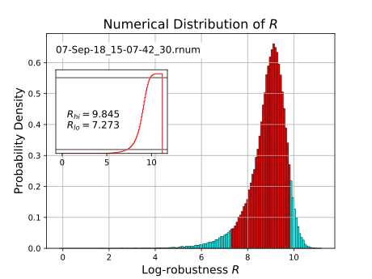

# Robustness: assessing tensions between data sets
## Scientific context
The Robustness (https://arxiv.org/abs/1101.1521) is a Bayesian statistical measure to assess
whether data sets are in tension, i.e., they do not follow the same statistical distribution. 
Its numeric value is commonly interpreted by the Jeffreys scale 
(https://amstat.tandfonline.com/doi/abs/10.1080/01621459.1995.10476572), but it has recently
shown to be misleading for generic problems (https://arxiv.org/abs/1210.7652). Motivated by this,
we studied a new approach that treats the Robustness as a random variable that follows a
probability distribution, just like data do in the frequentist view. The purpose is to provide a 
problem-dependent scale that allows objective judgement. Using the approach, this program 
calculates the distribution of the Robustness for linear Gaussian models and two equally sized and
equally distributed data sets. The algorithm includes an analytical formula for the weak prior
limit, and calculates the numerical distribution for general Gaussian priors.

## Purpose of this program
The purpose of this program is to estimate the probability of tensions between two equally
sized Gaussian datasets. This is done by calculating the frequentist distribution of the 
Robustness assuming that both sets are equally distributed. The code performs a p-value test
of the null hypothesis H0 that the two data sets are compatible (described by the same model),
outputting the interval boundaries [R_hi, R_lo] inside which a measured value of R would 
support _H0_. If the measured value R is smaller than R_lo, the datasets are likely to be in tension.
If R > R_hi, the datasets are likely to be in positive correlation (at 5 % significance
level, respectively).

## Input configurations
The program takes different input configurations characterizing data, the theoretical model, the
prior information and several operational parameters. Before each run, the user has to specify which
operation mode should be chosen: either weak prior & numerical, weak prior & analytical, or general 
prior & numerical. As an overview, the input configurations are:

 - data size, mean of data vector, data covariance matrix
 - prior fiducial parameters, prior precision matrix
 - number of model parameters, model design matrix
 - lower and upper border for the analytical calculation of the Robustness, number of intermediate
 steps
 - number of samples that contribute to the numerical distribution
 - choice of algorithm (weak prior analytical, weak prior numerical, general prior numerical)

## Output
The output information is the distribution of the Robustness written to a text file, as well as
the configuration parameters - the metadata - written into separate text files. In addition,  a
plot is produced that displays the probability distribution function (PDF), the cumulative 
distribution function (CDF), and the  corresponding (0.05, 0.95) credible intervals mentioned above.

## First steps 
### Dependencies
To run the program, one has first to ensure that the following libraries are installed and added e.g. 
to the standard Linux path `/usr/local/lib` to enable linking with the c++ compiler:
- GSL (Gnu Scientific Library)
- OpenSSL

### Getting started
To get started with the program, first switch to the program root directory, then:
`make`  
and
`./robustness_main [mode]`  
where [mode] can be replaced by:
- `20`: numerical algorithm, weak prior limit  
- `21`: analytical algorithm, weak prior limit  
- `30`: numerical algorithm, general prior.  

The inital configurations are defined in the respective initialization files located in ./init/.
 
